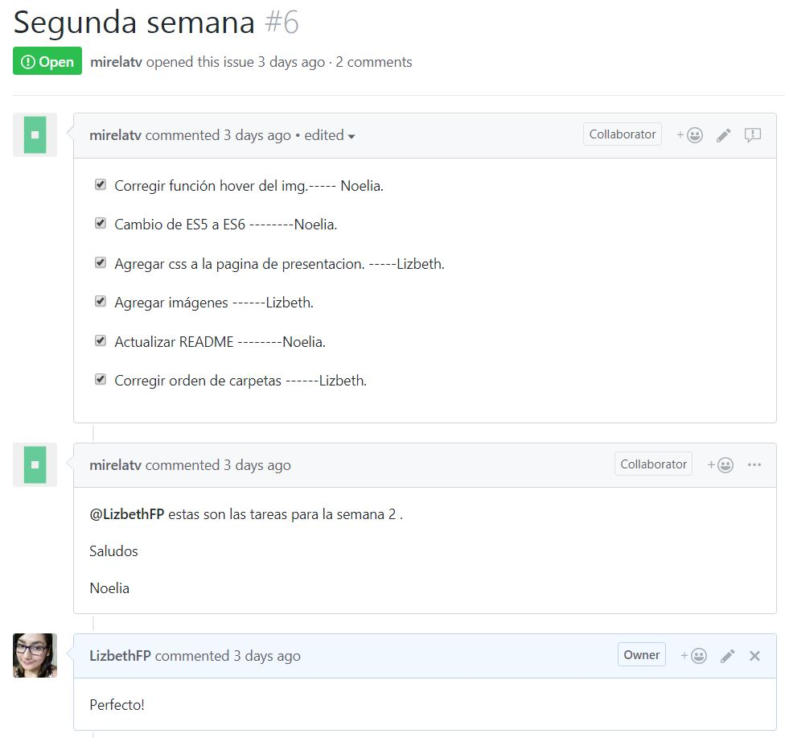

# Cardify

* **Track:** _Common Core_
* **Curso:** _JS Deep Dive: Crea tu propia librería usando JavaScript_
* **Unidad:** _Producto final_

***
## Descripción del proyecto

***changeImg*** es un plugin de jQuery que dado un _contenedor_ busca todas las
imágenes que encuentre dentro del _contenedor_ y las reemplaza por un nuevo
elemento `<figure>` que contenga la imagen (``) además de un `<figcaption>` con el texto del atributo `alt` de la imagen, este último elemento se mostrará centrado encima de la imagen al pasarle el mouse.

## Planificación
Se ha creado dos issues en el repositorio forkeado de Laboratoria, en los que se señala la planificación acordada en parejas.

En la primera semana, se tomó la decisión de optar por el reto de Cardify; se forkeó el repositorio del reto Cardify de Laboratoria; se asignaron las tareas de organización e investigación; se buscó información acerca de librería y jQuery plug-in, lo que denotó una diferencia entre ambas herramientas, ya que la primera implica una colección de varios métodos para realizar varias tareas y la segunda es una colección de pocos métodos para realizar tareas particulares, además de que se investigó acerca de la creación y estructura de ambas, y se consultó algunas dudas a los profesores. Asimismo, se decidió por asignar las tareas de la primera semana de la siguiente forma:

* Elección del tema - Noelia y Lizbeth
* Búsqueda de información del tema (investigación) - Noelia y Lizbeth
* Consulta a los profesores - Noelia y Lizbeth
* Redacción del README - Lizbeth
* Inicialización de la estructura del proyecto (HTML, Bootstrap, CSS, JS, plug-in) - Noelia y Lizbeth
* Inicialización de proyecto con npm init y git init - Lizbeth
* Inicialización de pruebas del plug-in - Noelia

En la segunda semana, se actualizará la información del README con los snippets del plug-in y se asignará las tareas de funcionalidad del plug-in entre ambas partners.

### Issue - Semana 1


#### Se elaboró en pareja un mapeo del flujo del plug-in


En la segunda semana, se contó con otro issue en el que se señala las tareas a ejecutar  de forma equitativa  en pareja.

En la segunda semana se  desarrollo el  codigo del pluggin, el llamado desde  el app/js,la  maquetación del html que  será  la presentación de  nuestro proyecto; se asignaron las tareas de organización e investigación para  la implementacion de  Babel en el proyecto Cardify. La distribucion de  tareas  quedó de  la siguiente forma:

* Código del Pluggin - Noelia
* Funcion de  llamada  desde  app/js - Noelia
* Maquetación de la página, usando  Boostrap y  CSS  -  Lizbeth
* Traspilación con Babel  - Lizbeth
* Modificación de  la  estructura  del proyecto -Lizbeth
* Actualización del README - Noelia
* Consulta  a  profesores - Lizbeth y Noelia


### Issue - Semana 2


## Descarga  del plug-in

Desde el   html  existe un link  para que el usuario pueda  descargarse  el  plug-in y utilizarlo, accediendo a un archivo zipeado con toda la  data  del  index.js (versión ES5).

## Uso del plug-in

El usuario deberá añadir las siguientes tres líneas de código en donde corresponda.

### Link desde  el Html

```html
  <script src="js/index.js"></script>
  <script type="text/javascript" src="js/app.js"></script>
```

### Línea de código en el que se aplica el plug-in.
El plug-in trabaja con una clase "container-img" como referencia para buscar las imágenes a las que ordenará semánticamente.

```js
  let container = $('.container-img');
```

### Llamado del plug-in desde archivo JS.
La estructura   de  llamado debe seguir la estructura anexa:

```js
  $(img).cardify({});
```
