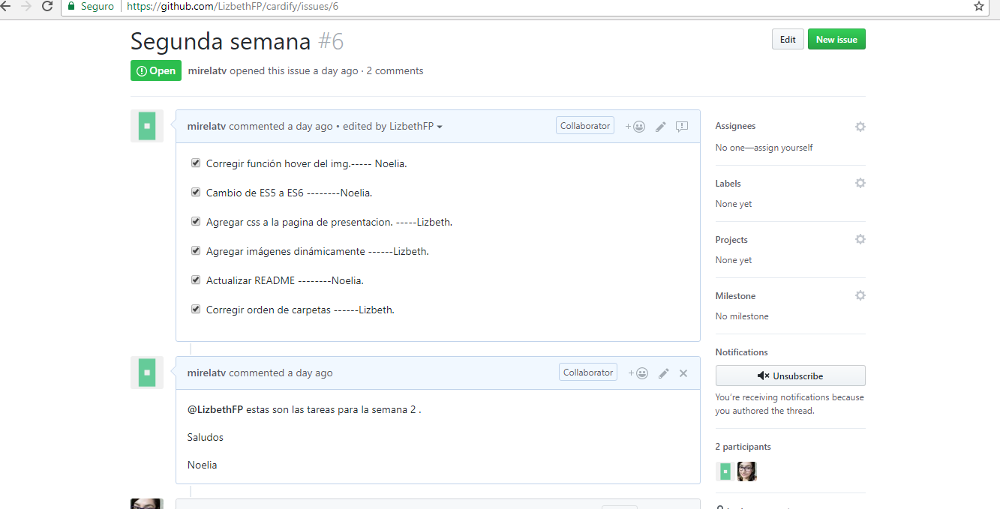

# Cardify

* **Track:** _Common Core_
* **Curso:** _JS Deep Dive: Crea tu propia librería usando JavaScript_
* **Unidad:** _Producto final_

***

## Planificación
Se ha creado un issue, en el que se señala las tareas  a ejecutar  de forma equitativa  en pareja.

En la segunda semana se  desarrollo el  codigo del pluggin, el llamado desde  el app/js,la  maquetacion del html que  sera  la presentacion de  nuestro proyecto; se asignaron las tareas de organización e investigación para  la implementacion de  Babel en el proyecto Cardify;la distribucion de  tareas  quedo de  la siguiente forma:

* Codigo del Pluggin - Noelia
* Funcion de  llamada  desde  app/js - Noelia
* Maquetacion de  la Pagina, usando  Boostrap y  css  -  Lizbeth
* Inicialización de  Babel  - Lizbeth
* Modificacion de  la  estructura  del proyecto -Lizbeth
* Redaccion del README - Noelia
* Consulta  a  profesores - Lizbeth - Noelia

### Issue - Semana 2

:)

...
